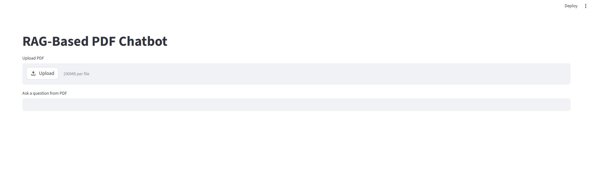
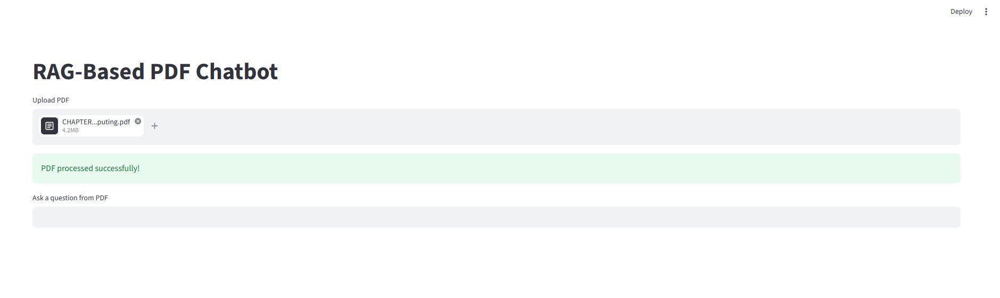
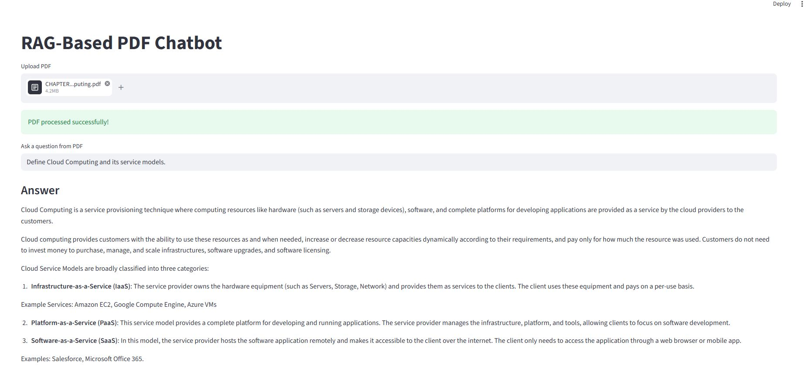

# AI PDF Chatbot (RAG)

Answers questions from any uploaded PDF using Retrieval-Augmented Generation.  
Upload a document → ask in plain English → get answers sourced strictly from that file.

**Live Demo:** Coming Soon

---

## Features

- Upload and chat with any PDF document
- Retrieval-Augmented Generation (RAG) for accurate, document-grounded answers
- Semantic search using FAISS vector store
- Context-aware AI responses via Groq LLM
- Clean Streamlit-based interface

---

## Preview

### Home Screen


### Upload Screen


### Chat Screen


---

## Tech Stack

| Layer         | Technology            |
|---------------|-----------------------|
| LLM           | Groq (LLaMA 3)        |
| Orchestration | LangChain             |
| Vector Store  | FAISS                 |
| Embeddings    | Sentence Transformers |
| PDF Parsing   | PyPDF2                |
| Frontend      | Streamlit             |

---

## How It Works

```
PDF Upload → Text Extraction → Chunking → Embedding
                                              |
User Query → Semantic Search → Relevant Chunks → Groq LLM → Answer
```

---

## Run Locally

```bash
git clone https://github.com/aps-codes/ai-pdf-chatbot-rag.git
cd ai-pdf-chatbot-rag
pip install -r requirements.txt
```

Create a `.env` file:

```
GROQ_API_KEY=your_key_here
```

Get a free key at [console.groq.com](https://console.groq.com), then:

```bash
streamlit run app.py
```